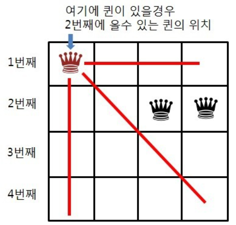
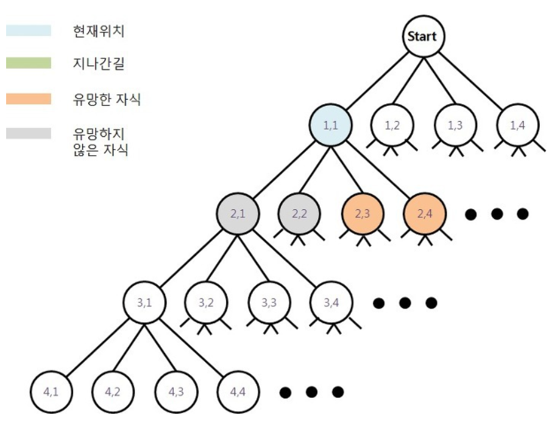

# Algorithm 정리

> 목차

[1. 백트래킹](#1-%eb%b0%b1%ed%8a%b8%eb%9e%98%ed%82%b9)
  - [4-Queens-Problem](#-4-queens-problem)

## 1. 백트래킹

백트래킹은 DFS(Depth First Search)와 같은 완전탐색이 아닌  DFS에 가지치기(Pruning)를 통해 가도 되지 않는 노드를 고려하지 않고 탐색하는 완전탐색기법이다.

즉,  어떤 노드의 유망성 점검 후, 유망하지 않으면 그 노드의 부모  노드로 되돌아간 후 다른 자손 노드를 검색하는 것이다.

유망하지 않으면 "배제"를 하고 부모 노드로 되돌아가면서 풀이 시간이 "단축"된다.

백트래킹 알고리즘으로 가장 쉽게 접할 수 있는 문제는 "4-Queens-Problem"이다.

### ■ 4-Queens-Problem

    크기가 4 * 4인 체스판 위에 퀸 4개를 서로 공격할 수 없게 놓는 배치 경우를 구하는
    경우를 구하는 문제
   

퀸이 현재 (1,1)에 위치하고 있을 때 빨간색 선이 퀸이 이동할 수 있는 경로이고,  (1, 1)에 위치한 퀸과 공격할 수 없게 두 번째 줄에 퀸을 배치하려면 (2,3)과 (2,4)에 배치해야 한다.

첫 번째 퀸의 위치가 (1,1)일 때 트리 구조는 다음과 같다.

DFS는 유망하지 않은 (2,1)과 (2,2)도 검사를 했을 것이다.  그렇게 되면 체스판에 퀸을 배치하는 경우의 수를 찾기 위해 더 많은 연산이 소요될 것이다.

그래서 백트래킹은 가지치기가 중요하다 ! 백트래킹은 크게 3가지 절차로 구성되어 있다.

1. DFS 수행
	- DFS를 수행하여 노드를 찾는다.
2. 유망한 노드 검토
	-  방문한 노드가 유망한 노드이면 DFS를 계속 수행하고 아니라면 백트래킹을 수행한다.
3.  백트래킹 수행
	- 방문한 노드를 가지치기하고 상위 노드로 이동하여 다시 DFS를 수행한다.

이 절차를 통해서 두 번째 줄에 퀸을 놓는 방법을 생각해보자.

1. Root에서 시작해서 (1,1)부터 DFS를 수행한다.
2. 두번째 줄에 첫번째 노드인 (2,1)로 이동한다.
3. (2,1)의 유망성 검사를 해보니 첫 번째 퀸의 이동반경에 포함되기 때문에 유망한 노드가 아니라 판단,  백트래킹을 수행하여 상위 노드인 (1,1)로 다시 이동한다.
4. 다시 DFS를 수행하여 (2,2)로 이동한다.
5. (2,2)의 유망성 검사를 해보니 첫 번째 퀸의 이동반경에 포함되기 때문에 유망한 노드가 아니라 판단, 백트래킹을 수행하여 상위 노드인 (1,1)로 다시 이동한다.
6. 다시 DFS를 수행하여 (2,3)으로 이동한다.
7. (2,3)의 유망성 검사를 해보니 첫 번째 퀸의 이동반경에 포함되지 않아서 유망한 노드로 판단. 이제 (2,3)을 기준으로 DFS를 수행한다. 

아래는 자바로 작성한 코드이다.

    public class N_Queens_Problem {
	    static int[] Q;
		static int N;
		
		public static void main(String[] args) {
			BufferedReader br = 
				new BufferedReader(new InputStreamReader(System.in));
		
			// N개의 퀸 
			N = Integer.parseInt(br.readLine());
			// 각 row(index)의 Q의 위치를 저장하기 위해 1차원 배열
			Q = new int[N];

			for (int i = 0; i < N; i++)
			{
				Q[0] = i;
				dfs(1);
			}
		}
		
		public static void dfs(int row) {
			// row가 N이라면 마지막 행에서도 유망성 검사를 통과하여
			// dfs(row+1)을 수행했다는 이야기이므로
			// 여기서 종료조건을 건다.
			if (row == N)
			{
				printQueen();
			}
			
			for (int i = 0; i < N; i++)
			{
				// 유망성을 미리 검사
				if (isPossible(row, i))
				{
					Q[row] = i;
					dfs(row + 1);
				}
			}
		 }
		
 		 public static boolean isPossible(int row, int col) {
	 		 for (int i = 0; i < row; i++)
			 {
				// 같은 열에 있는지 검사
				if (Q[i] == col)
				{
					return false;
				}
				// 대각선 위치 검사식
				else if (Math.abs(i-row) == Math.abs(Q[i]-col))
				{
					return false;
				}
			}	
			return true;
		}
	}
 